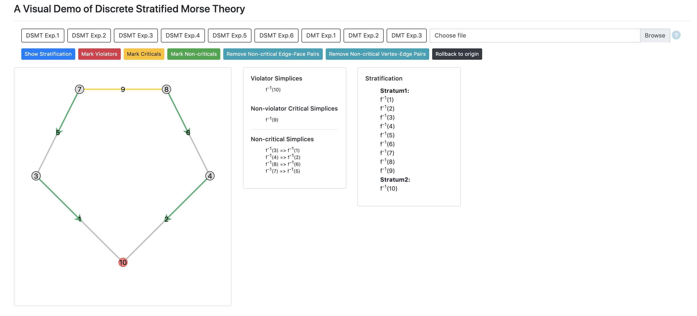
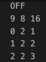

# A Visual Demo of Discrete Stratified Morse Theory

By [Youjia Zhou](https://www.sci.utah.edu/people/zhou325.html), 
[Kevin Knudson](https://people.clas.ufl.edu/kknudson/) and [Bei Wang](http://www.sci.utah.edu/~beiwang/).

## Overview

This is a demo that implements algorithms for discrete stratification Morse theory (DSMT).

The main features of our system:
- Given a 2-dimensional simplicial complex, construct the discrete stratified Morse function and demonstrate the stratification.
- Mark violators/ criticals/ non-critical pairs.
- Perform simplification by removing non-critical pairs.



<!-- To see a live demo, go to https://vis-dsmt.herokuapp.com/. -->

<!-- This is developed by Youjia Zhou, Yulong Liang and Bei Wang.  -->

For theoretical and algorithmic details on DSMT, please refer to:

Discrete Stratified Morse Theory: Algorithms and A User's Guide. 
Kevin Knudson, Bei Wang.
ArXiv:1801.03183, 2019.

https://arxiv.org/abs/1801.03183

An earlier version appears as an extended abstract:

Discrete Stratified Morse Theory: A User's Guide.
Kevin Knudson and Bei Wang.
International Symposium on Computational Geometry (SOCG), 2018.

## Working Demo
To see a live demo, go to: 

https://vis-dsmt.herokuapp.com/

It runs on most modern web browsers. We suggest you use Google Chrome.

## Installation
```bash
git clone git@github.com:beiwphillips/VIS-DSMT.git
```

## Execution
```bash
cd VIS-DSMT
python3 run.py
# Hit Ctrl+c to quit
```

You can view the page at http://0.0.0.0:8000/.

## Importing a new example
Users can import a new example with specific data format.

The imput file should be a TXT file of the following format.



- The second line specifies the number of vertices, faces and edges.

- Starting from the third line, each line specifies the position and function value of a simplex, in order of vertices, faces and edges.

- For vertices, the position is represented as its x and y coordinates. For faces and edges, the position is represented as th index of the vertices on its boundary.

- The imported example is expected to be some planar geometric 2-dimensional simplicial complex (e.g., a planar triangulation).

## Implementation Details
Our system is web-based and can be accessed from any modern web-browser (tested using Google Chrome). 

The tool is implemented in HTML, CSS, and JavaScript. The algorithm is implemented in pure JavaScript, and the module collection *D3.js* is used for redering SVGs and providing interactive visualization.

## Acknowledgments
This work was supported in part by the National Science Foundation (NSF) grants IIS-1513616 and DBI-1661375. We thank Yulong Liang who worked on the first prototype of the visualization.