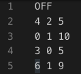

# Visual Demo of Discrete Stratified Morse Theory

By [Youjia Zhou](https://github.com/zhou325), 
[Yulong Liang](https://github.com/leong1016) and [Bei Wang](https://github.com/beiwphillips).

## Overview

This is a demo that implements algorithms for discrete stratification Morse theory (DSMT).

The main features of our system:
- Display stratification
- Mark violators/ criticals/ non-critical pairs
- Remove non-critical pairs

<!-- To see a live demo, go to https://vis-dsmt.herokuapp.com/. -->

<!-- This is developed by Youjia Zhou, Yulong Liang and Bei Wang.  -->

For theoretical and algorithmic details on DSMT, please refer to:

Discrete Stratified Morse Theory: Algorithms and A User's Guide. 
Kevin Knudson, Bei Wang.
ArXiv:1801.03183, 2019.

https://arxiv.org/abs/1801.03183

An earlier version appears as an extended abstract:

Discrete Stratified Morse Theory: A User's Guide.
Kevin Knudson and Bei Wang.
International Symposium on Computational Geometry (SOCG), 2018.

## Working Demo
To see a live demo, go to: 

https://vis-dsmt.herokuapp.com/

It runs on most modern web browsers. We suggest you use Google Chrome.

## Installation
```bash
git clone git@github.com:beiwphillips/VIS-DSMT.git
```

## Execution
```bash
cd VIS-DSMT
bash run.sh
# Hit Ctrl+c to quit
```

You can view the page at http://0.0.0.0:8080/.

## Importing a new example
Users can importing a new example with specific data format.

The imput file should be a TXT file of the following format.
